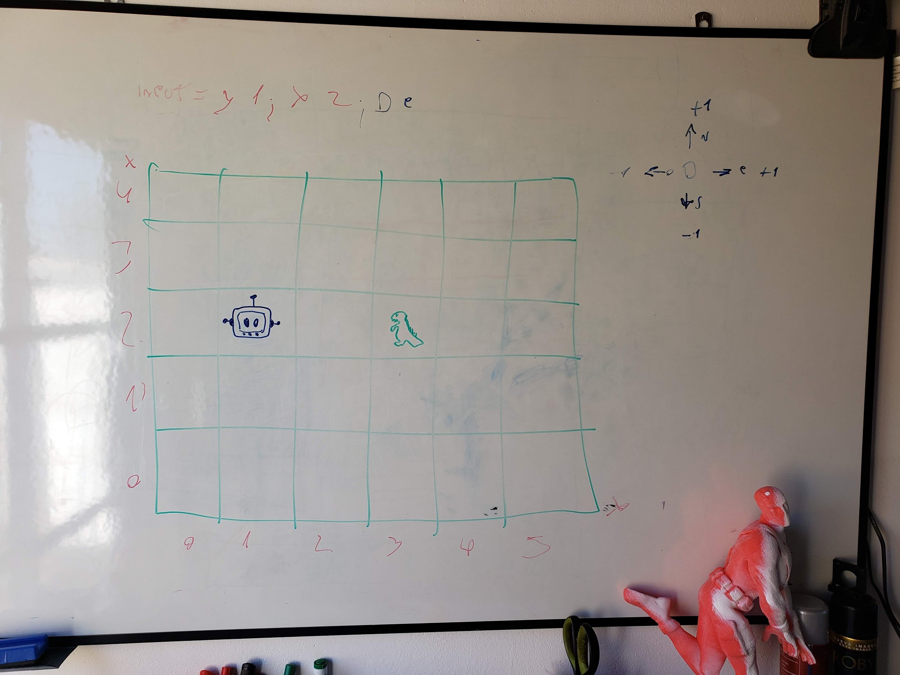

### Dionsaurios vs Robots

##Referencia
 Aplicacion desarrollada como desafio para nubank, se supone que tiene que contar con lo siguiente
    
    - Be able to create an empty simulation space - an empty 50 x 50 grid;
    - Be able to create a robot in a certain position and facing direction;
    - Be able to create a dinosaur in a certain position;
    - Issue instructions to a robot - a robot can turn left, turn right, move forward, move backwards, and attack;
    - A robot attack destroys dinosaurs around it (in front, to the left, to the right or behind);
    - The attack does not affect robot facing direction;
    - No need to worry about the dinosaurs - dinosaurs don't move;
    - Display the simulation's current state;
    - Two or more entities (robots or dinosaurs) cannot occupy the same position;
    - Attempting to move a robot outside the simulation space is an invalid operation.
 Tambien es posible que no cumpla con todos los criterios, pero me diverti mucho desarrollando y aprendi mucho ya que lo utilice para por sobre todo para aplicar cosas que tenia ganas de usar y nunca podia entre ellas 
    
    RxJava
    Swagger2
   Esta aplicacion esta desarollada en Java y Spring-boot, el criterio de seleccion del lenguaje y la arquitectura fueron realizado en cuestion de mi nutos, me hubiera divertido mas si hubiera elegido kotlin pero lo tenia que entregar hace como una semana y colgue.
   tambien me di el gustaso de hacerlo todo con TDD, la realidad que el codigo no es una maravilla quizas ni algo safable, pero lo trate de hacer lo mejor posible lo que se ve es una 6 iteracion de lo que habia hecho en un comienzo asi que se pueden imaginar lo peor que todo esto era.
   
   

##Instrucciones 
#### Pre resquisito
| Programa | Version |
| --- | ----------- |
| Java | 1.8 |
| gradle | 5.2.1|

parado en el raiz :ejecutar

```sybase
    $ gradle bootRun
```

##como se usa
una vez que se siguieron las instrucciones :

hay documentacion auto-generada con swagger y se puede aceder desde aqui `http://localhost:8080/swagger-ui.html`

pero la verdad que es medio un bardo de entender a si que aca van los trucos:

robot-fighter y dinasour fighter son las dos clases principales, 
 `/---Fighter---/add/x/y` hace que se agregue un luchador en la grilla en una determinada posicion
 `/robot/rotate/{compass}` compas hace referencia los puntos cardinales N,S,E,O 
 
 creo que esos son los end poinds mas complejos de explicar
 
 como lo pense ? bueno le saco una fotito.
 
 